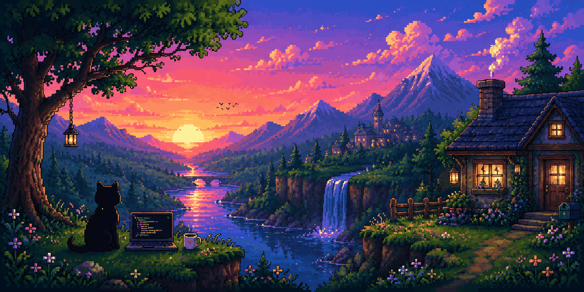

  
  
<code>☕ Probably coding. Probably.</code>

<h3 align="center">🛠️ Toolbox</h3>

  

<h3 align="center">📊 Stats & Numbers</h3>

  

    
    
  

  

    
  

<h3 align="center">☕ Tinkering & Projects</h3>

<table width="100%">
  <thead>
    <tr>
      <th width="24%" align="left">Project</th>
      <th width="14%" align="center">Tech</th>
      <th width="16%" align="center">Category</th>
      <th width="46%" align="left">Highlights &amp; Description</th>
    </tr>
  </thead>
  <tbody>
    <tr>
      <td><a href="https://github.com/NhatPrv/discord-quest-completer"><b>discord-quest-completer</b></a></td>
      <td align="center"><code>Vue</code></td>
      <td align="center"><code>Desktop App</code></td>
      <td>Windows desktop application to complete quests on Discord without installing full games</td>
    </tr>
    <tr>
      <td><a href="https://github.com/NhatPrv/image_agent"><b>image_agent</b></a></td>
      <td align="center"><code>Python</code></td>
      <td align="center"><code>Automation</code></td>
      <td>Local image processing tool &amp; agent workflow experimentation for automated media tasks</td>
    </tr>
    <tr>
      <td><a href="https://github.com/NhatPrv/MCLauncher"><b>MCLauncher</b></a></td>
      <td align="center"><code>TypeScript</code></td>
      <td align="center"><code>Game Client</code></td>
      <td>Custom lightweight Minecraft launcher featuring modpack support and performance optimization</td>
    </tr>
    <tr>
      <td><a href="https://github.com/NhatPrv/PC_Control_For_PC"><b>PC_Control_For_PC</b></a></td>
      <td align="center"><code>Dart</code></td>
      <td align="center"><code>Remote Utility</code></td>
      <td>Cross-device remote control utility to manage, monitor, and execute PC commands seamlessly</td>
    </tr>
    <tr>
      <td><a href="https://github.com/NhatPrv/paper-desktop"><b>paper-desktop</b></a></td>
      <td align="center"><code>TypeScript</code></td>
      <td align="center"><code>Desktop Canvas</code></td>
      <td>Interactive dynamic desktop wallpaper and live canvas tool built with modern web technologies</td>
    </tr>
  </tbody>
</table>

 

  *No bugs were harmed in the making of this profile* 🐈‍⬛

