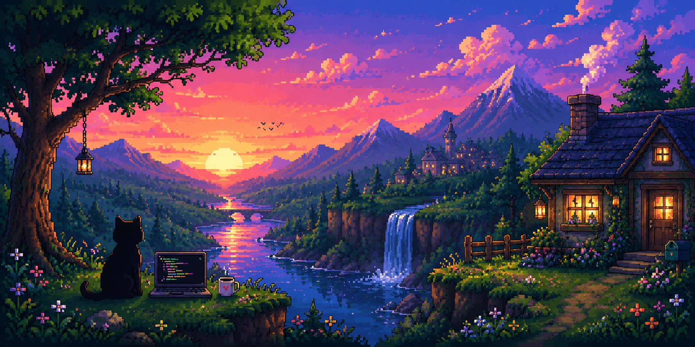

  
  
<code>☕ Probably coding. Probably.</code>

<h3 align="center">🛠️ Toolbox</h3>

  

<h3 align="center">📊 Stats & Numbers</h3>

  
  
   
  

<h3 align="center">☕ Tinkering & Projects</h3>

| Project | Tech | Description |
| :--- | :---: | :--- |
| [**discord-quest-completer**](https://github.com/NhatPrv/discord-quest-completer) | `Vue` | Complete Discord quests without downloading full games |
| [**image_agent**](https://github.com/NhatPrv/image_agent) | `Python` | Local image & agent workflow experiments |
| [**MCLauncher**](https://github.com/NhatPrv/MCLauncher) | `TypeScript` | Custom lightweight Minecraft launcher |
| [**PC_Control_For_PC**](https://github.com/NhatPrv/PC_Control_For_PC) | `Dart` | PC remote controller utility |
| [**paper-desktop**](https://github.com/NhatPrv/paper-desktop) | `TypeScript` | Interactive desktop wallpaper tool |

 

  *No bugs were harmed in the making of this profile* 🐈‍⬛

